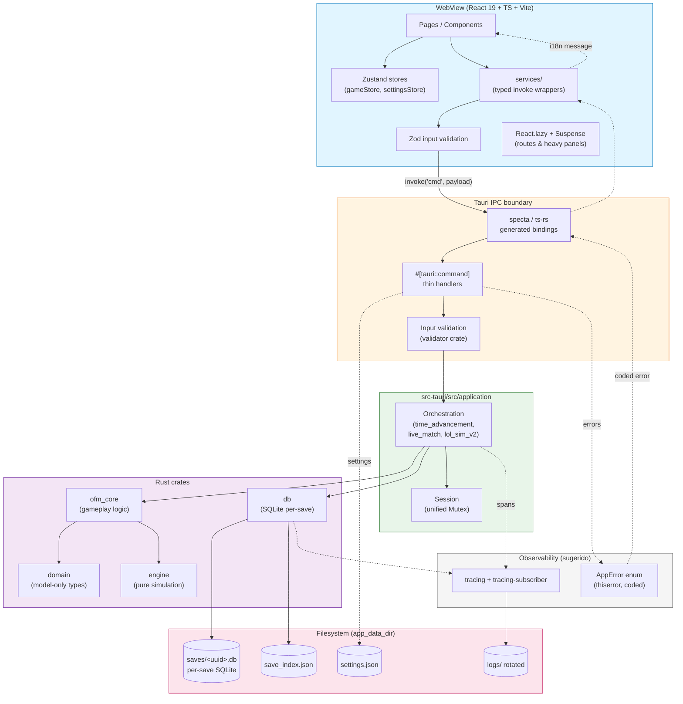

# Análisis Técnico Arquitectónico — Open League Manager (OLManager)

**Rol:** Arquitecto de Software / Lead Developer Senior
**Versión analizada:** 0.1.2 (pre-alpha, GPL-3.0)
**Fecha:** 2026-05-02
**Repositorio:** OLManager (continuación de OpenFootManager)

---

## 0. Resumen del proyecto (real, tras revisión del código)

OLManager **no** es una API de inventarios — es un **juego de gestión deportiva de escritorio** (League of Legends manager) construido con:

| Capa | Tecnología | Tamaño aprox. |
|---|---|---|
| Frontend | React 19 + TypeScript + Vite + Tailwind 4 + Zustand 5 + react-router 7 + i18next | ~71.500 LOC TS/TSX, 228 componentes |
| Backend | Rust + Tauri v2 (4 crates: `domain`, `engine`, `ofm_core`, `db`) + comandos `src-tauri/src` | ~77.000 LOC Rust, 173 archivos |
| Persistencia | SQLite por partida (`rusqlite` + `rusqlite-migration`), 37 migraciones versionadas | — |
| Tests | Vitest (107 tests frontend) + `cargo test` (tests por crate) | — |
| CI/CD | GitHub Actions (`pr.yml` y `release.yml`) | — |

**Arquitectura real:** monolito desktop con frontera IPC bien definida (Tauri commands), backend Rust dividido por *bounded contexts* en crates. La capa `domain` es model-only, `engine` se aísla para simulación, `ofm_core` orquesta gameplay y `db` aísla SQLite. La regla de dependencia documentada en `docs/ARCHITECTURE.md` es **correcta y deseable**.

A continuación, el análisis sigue el formato **Problema encontrado → Solución sugerida**.

---

## 1. Arquitectura y Diseño

### Problema 1.1 — Comandos Tauri convertidos en "god files"
`src-tauri/src/commands/game.rs` tiene **2.291 líneas** y mezcla seeds de academia, parsing de fechas, slugify, lookups de nacionalidad y los propios comandos Tauri (`start_new_game`, `save_game`, `load_game`, `update_manager_profile`, etc.). Lo mismo en `src-tauri/src/application/lol_sim_v2.rs` con **6.281 líneas**.

**Solución sugerida:**
- Extraer del módulo `commands/game.rs` los helpers no-Tauri a un módulo `application/game_setup/` (parsing, seeds, slug). Mantener en `commands/game.rs` únicamente funciones `#[tauri::command]` (esperado: <300 líneas).
- Romper `application/lol_sim_v2.rs` en submódulos por dominio (`combat.rs` ya existe — completar la separación: `economy`, `objectives`, `vision`, `events`, `state`).
- Regla: **máximo 500 LOC por archivo Rust, 300 LOC por archivo TS/TSX**. Hacer cumplir con un check de CI (script simple en `pr.yml`).

### Problema 1.2 — Componentes React monolíticos
`ChampionDraft.tsx` (3.149 LOC), `MatchSimulation.tsx` (1.922 LOC), `LolMatchLive.tsx` (1.200 LOC), `PlayerProfile.tsx` (1.093 LOC). Estos componentes son contenedores con lógica de negocio, vistas, modales y orquestación de servicios.

**Solución sugerida:**
- Aplicar **Container/Presentational** y extraer hooks de vista (`useDraftReducer`, `useMatchControls`).
- Mover lógica derivada/calculada a `lib/` o `*Helpers.ts` (el patrón ya existe — ej. `dashboardHelpers.ts`, `inboxHelpers.tsx`); usarlo de forma consistente.
- Considerar `useReducer` o un slice de Zustand dedicado para estados con muchas transiciones (draft, live match) en lugar de `useState` apilados.

### Problema 1.3 — Frontera frontend↔backend tipada manualmente
Las DTOs Rust (`#[derive(Serialize)]`) y los tipos TS (`store/types.ts`, ~60 tipos exportados desde `gameStore.ts`) se mantienen en paralelo a mano. Cualquier cambio en Rust que olvide actualizar TS solo se nota en runtime.

**Solución sugerida:**
- Adoptar **`ts-rs`** o **`specta`** + `tauri-specta`: anota los tipos Rust con `#[derive(TS)]`/`#[derive(Type)]` y genera automáticamente `bindings.ts` consumido por el frontend.
- Tipar también los nombres de comando para que `invoke("save_game")` deje de ser un string-literal y sea verificable en compilación.
- Beneficio inmediato: cualquier cambio rompedor en una struct Rust falla en `build:types` antes de llegar a producción.

### Problema 1.4 — Estado global en `StateManager` con `Mutex<Option<T>>`
`ofm_core::state::StateManager` mantiene `Mutex<Option<Game>>`, `Mutex<Option<StatsState>>`, `Mutex<Option<LiveMatchSession>>`, `Mutex<Option<String>>`. Cuatro mutexes independientes invitan a *deadlocks* si dos comandos los toman en orden distinto, y a *race conditions* lógicas (ej. `active_save_id` cambia entre dos lecturas del mismo comando).

**Solución sugerida:**
- Agrupar los cuatro campos bajo **una única struct `Session`** protegida por un `RwLock` o un `parking_lot::Mutex` (mejor diagnóstico que `std::sync::Mutex`).
- Para operaciones que combinan lectura y escritura, exponer métodos transaccionales (`with_session_mut(|s| ...)`).
- Pensar a futuro en `tokio::sync::Mutex` si los comandos se vuelven async-cooperativos.

### Problema 1.5 — Microservicios / refactors prematuros (no aplicable aquí)
El monolito desktop con crates es la decisión **correcta** para este dominio (juego determinista, save local, single-player). No fragmentar.

**Solución sugerida:** mantener la disciplina actual de crates y considerar extraer `engine` como crate publicable (futuro mod-loading o servidor de simulación headless) cuando haya un caso de uso real.

---

## 2. Seguridad

### Problema 2.1 — Path traversal en `save_manager_avatar` y `load_manager_avatar`
`src-tauri/src/commands/game.rs:2173-2235` toma `filename: String` del frontend y lo concatena con `app_data_dir.join(&filename)` sin sanitizar. Un `filename = "../../../../etc/passwd"` (Linux) o `..\\..\\..\\Windows\\System32\\drivers\\etc\\hosts` permite **escribir/leer fuera del directorio** de la app.

**Solución sugerida:**
```rust
fn safe_avatar_filename(input: &str) -> Result<String, String> {
    let bytes = input.as_bytes();
    if input.is_empty() || input.len() > 128 { return Err("invalid length".into()); }
    if bytes.iter().any(|&b| b == b'/' || b == b'\\' || b == 0) { return Err("invalid char".into()); }
    if input.contains("..") || input.starts_with('.') { return Err("path traversal".into()); }
    let ext_ok = matches!(
        input.rsplit('.').next(),
        Some("png") | Some("jpg") | Some("jpeg") | Some("webp")
    );
    if !ext_ok { return Err("unsupported extension".into()); }
    Ok(input.to_string())
}
```
Aplicar **antes** de cualquier `join()`. Adicionalmente, después de construir el path, validar `file_path.canonicalize()?.starts_with(avatar_dir.canonicalize()?)`.

### Problema 2.2 — CSP deshabilitado en `tauri.conf.json`
`"security": { "csp": null }` desactiva la protección de Tauri contra XSS desde recursos remotos o injerencias en el WebView. En una app de escritorio que carga `data:` URLs (avatares en base64) y URLs externas (logos en `infer_team_name_from_url`), esto es un riesgo real.

**Solución sugerida:**
```json
"security": {
  "csp": "default-src 'self'; img-src 'self' data: asset:; style-src 'self' 'unsafe-inline'; script-src 'self' 'wasm-unsafe-eval'; connect-src 'self' ipc: http://ipc.localhost"
}
```
Ajustar `img-src` y `connect-src` a las URLs realmente necesarias (Leaguepedia, CDNs propios). Probar progresivamente.

### Problema 2.3 — Capacidades Tauri demasiado abiertas (revisar)
`capabilities/default.json` declara `core:default` (incluye `core:webview:default`, `core:event:default`, `core:path:default`) y `opener:default`. `opener` puede abrir URLs/archivos arbitrarios — si un bug permite que un mensaje de inbox controle el target, se vuelve un vector de phishing/ejecución.

**Solución sugerida:**
- Restringir `opener` a un *allowlist* de scopes (`https://*.leaguepedia.com`, `https://github.com/openleaguemanager/*`).
- Pasar de `core:default` al subconjunto realmente usado.

### Problema 2.4 — Inyección SQL: actualmente OK, pero frágil
La revisión de `repositories/player_repo.rs` muestra que casi todas las queries usan `params![...]` (parametrizadas). Sin embargo, hay `format!` en strings que construyen partes de la query (ej. `format!("PRAGMA table_info({table})")` en `migrations.rs`). Hoy `table` es estático, pero el patrón está abierto a regresiones.

**Solución sugerida:**
- Lint local: prohibir `format!` cuyo resultado se pase a `.execute()` o `.prepare()`. Crear un test o un `xtask` que escanee.
- Considerar migrar a **`sqlx`** (queries verificadas en compilación contra el schema) o **Diesel**. Es un esfuerzo importante con 37 migraciones, pero elimina toda una clase de bugs.
- Revisar `serde_json::to_string()` masivo en `player_repo.rs` (atributos, traits, stats, career, transfer_offers, morale_core son JSON blobs en columnas TEXT). Esto rompe la integridad referencial y dificulta queries — ver §3.1.

### Problema 2.5 — Validación de inputs inconsistente
`update_manager_profile` (líneas 2238-2291) limita `first_name` y `last_name` a 30 chars, pero **no limita `nickname`** (puede ser arbitrariamente largo) y **no valida `nationality`** ni `avatar_path`. La validación es ad-hoc, dispersa por cada comando.

**Solución sugerida:**
- En Rust: usar **`validator`** crate con derive (`#[derive(Validate)]`, `#[validate(length(min=1, max=30))]`) sobre DTOs de comando.
- En TS: **Zod** para validar antes de llamar a `invoke()`. Compartir constantes (`MAX_NAME_LENGTH = 30`) en un archivo generado por `ts-rs`.
- Doble validación (cliente + servidor) — el cliente solo es UX, el servidor es la autoridad.

### Problema 2.6 — `unwrap()`/`expect()` en runtime
67 `unwrap()` en `src-tauri/src/` (excluyendo tests) y 4 `expect()` en `lib.rs` que abortan el proceso si falla `app_data_dir`, `create_dir_all`, `SaveManager::init`. En desktop esto se traduce en cierre abrupto sin mensaje útil al usuario.

**Solución sugerida:**
- Reemplazar `unwrap()` en código de producción por `?` y propagar como `Result<_, String>` hasta el comando, donde se mapea a un error visible.
- En `setup`, mostrar un diálogo Tauri (`tauri::api::dialog::message`) con la causa antes de `panic!`.
- Lint `clippy::unwrap_used` y `clippy::expect_used` activado para `src-tauri/src/`.

### Problema 2.7 — Dependencias sin auditoría automática
No hay `cargo-audit` ni `npm audit` en `pr.yml`. `Cargo.lock` y `package-lock.json` están versionados (bien), pero nadie está mirando RustSec.

**Solución sugerida:**
- Añadir job `cargo audit --deny warnings` (acción oficial `rustsec/audit-check`).
- Añadir `npm audit --omit=dev --audit-level=high` o **Renovate / Dependabot** para PRs automáticos de actualizaciones.
- Trivy/Syft para escanear el bundle final en `release.yml`.

---

## 3. Rendimiento y Optimización

### Problema 3.1 — Modelo de datos "JSON-en-TEXT" en SQLite
`player_repo.rs` serializa `attributes`, `traits`, `stats`, `career`, `transfer_offers`, `morale_core`, `alternate_positions` como `serde_json` a columnas `TEXT`. Esto significa:
- Cualquier query "jugadores con `pace > 80`" obliga a leer el blob, deserializar en memoria y filtrar en Rust — **O(n)** sobre toda la tabla.
- 37 migraciones acumuladas indican que el schema ya está pagando esa deuda (ej. `v003_alternate_positions`, `v005_player_training_focus`, `v013_player_fitness` añaden columnas dedicadas porque el JSON no servía).

**Solución sugerida:**
- Mover los campos sobre los que se hacen queries o estadísticas a **columnas reales** y mantener JSON solo para datos opacos.
- Aprovechar **JSON1** de SQLite para queries directas: `WHERE json_extract(attributes, '$.pace') > 80`. SQLite soporta índices funcionales: `CREATE INDEX idx_pace ON players(json_extract(attributes, '$.pace'));`.
- Establecer una norma en `docs/ARCHITECTURE.md`: "campos consultados → columnas; campos solo serializados/derivados → JSON".

### Problema 3.2 — Migraciones sin transacción explícita y sin rollback documentado
Las migraciones usan `rusqlite-migration` (que ya envuelve en transacción cada `M`). No hay tests de migración real (abrir un save de v001 y aplicar las 37) ni un *fixture* de save antiguo en `tests/`.

**Solución sugerida:**
- Añadir `db/tests/migration_tests.rs`: un fixture binario `tests/fixtures/save_v001.db` que se abra y aplique todas las migraciones en CI.
- Documentar cada migración con un comentario header: contexto, columnas afectadas, riesgo.

### Problema 3.3 — Bundle frontend: code-splitting parcial
`vite.config.ts` define `manualChunks` para `react-vendor`, `router`, `tauri`, `i18n`, `icons` — esto está **bien**. Pero los módulos de juego más pesados (`ChampionDraft.tsx` 3K LOC, `simulation.ts` 2,8K LOC, `MatchSimulation.tsx` 1,9K LOC) cuelgan del chunk principal y el primer paint los descarga aunque el usuario empiece en el menú.

**Solución sugerida:**
- Las rutas `/match` y `/dashboard` ya están con `React.lazy()` (✓).
- Aplicar `React.lazy` adicional a sub-vistas pesadas dentro de `Dashboard` (ej. `ChampionDraft` solo cuando se entra a la pestaña de draft).
- Activar `vite-bundle-visualizer` y poner un *budget* en CI: `dist/assets/index-*.js < 500 KB gzip`. Si supera, falla el build.

### Problema 3.4 — `useEffect` masivo (103 ocurrencias)
Más de 100 `useEffect` en el frontend. Patrones típicos a auditar: efectos sin cleanup, dependencias incorrectas que disparan loops, sincronización de stores con backend que se ejecuta en cada render.

**Solución sugerida:**
- Activar `eslint-plugin-react-hooks` con `exhaustive-deps: error` (no warn).
- Patrones a sustituir:
  - "Fetch en `useEffect`" → **TanStack Query** (`@tanstack/react-query`) con cache, retry y background refetch. Encaja perfecto con servicios `invoke()`.
  - "Sincronizar prop a state" → derivar en render directamente.
- Auditar los componentes con >3 `useEffect`: probablemente necesitan un hook custom o un reducer.

### Problema 3.5 — Logging muy verboso en runtime
`tauri_plugin_log` con `Debug` para `olmanager_lib`, `ofm_core`, `engine`, `db` y rotación cada 5 MB sin tope total. En partidas largas el disco se llena.

**Solución sugerida:**
- En release: bajar a `Info` por defecto, `Debug` solo opt-in (variable de entorno o setting).
- Rotación: limitar a `KeepN(10)` (50 MB total) en lugar de `KeepAll`.
- Considerar `tracing` + `tracing-subscriber` para *spans* estructurados (mucho más útil para correlacionar un `advance_time` complejo).

### Problema 3.6 — Mutex `std::sync` en backend Tauri async
Los comandos Tauri son `async fn`, pero los locks son `std::sync::Mutex`. Bloquear un mutex sync dentro de async puede bloquear el thread del runtime.

**Solución sugerida:**
- `parking_lot::Mutex` (mejor diagnóstico, sin envenenamiento) o `tokio::sync::Mutex` para secciones largas.
- Reglar tiempo máximo dentro del lock: leer/clonar y soltar antes de I/O (SQLite). Hoy `SaveManager::save_game` clona el `Game` antes de escribir — bien — pero el lock del `SaveManagerState` se mantiene durante toda la escritura SQLite.

---

## 4. Mantenibilidad y Testing

### Problema 4.1 — Pirámide de tests aceptable, pero `cargo test` es `continue-on-error: true` en PR
En `.github/workflows/pr.yml:72` se ejecuta `cargo test --workspace` con `continue-on-error: true`. **Los tests Rust que fallen no rompen la build.** El `README.md` lo confirma: "tracked as pre-existing runtime/test debt".

**Solución sugerida:**
- Auditar exactamente qué tests están rotos. Marcarlos como `#[ignore = "tracked: issue #N"]` con un issue real.
- Quitar `continue-on-error` para que la regresión futura sí rompa. La política "todo o nada" es más sana que "opt-in al rigor".
- Métrica visible: badge de tests pasando / ignorados en `README.md`.

### Problema 4.2 — Tests frontend con foco en helpers, poco end-to-end
107 archivos `*.test.*`, mayoritariamente unitarios sobre helpers (`dashboardHelpers.test.ts`, `HomeTab.helpers.test.ts`) y componentes con React Testing Library. **No hay tests E2E** de un flujo completo (crear partida → seleccionar equipo → simular semana → guardar → reabrir).

**Solución sugerida:**
- Añadir **Playwright** + `@tauri-apps/cli`'s mode headless o **WebdriverIO con tauri-driver** para 5–10 *smoke flows* críticos:
  1. Crear nueva partida.
  2. Avanzar tiempo a primer match.
  3. Simular match (modo skip).
  4. Guardar y cerrar la app.
  5. Reabrir y verificar continuidad.
- E2E en un job nightly de CI, no en cada PR (es lento).
- En el lado puro: tests de **propiedad** con `proptest` para el motor de simulación (ej. "el oro nunca decrece") — encajan natural en `engine` y `ofm_core`.

### Problema 4.3 — Documentación arquitectónica buena, pero sin diagrama vivo
`docs/ARCHITECTURE.md` está bien escrita y es accionable (✓). Sin embargo el "diagrama" es ASCII en bloques de código y queda desactualizado fácilmente.

**Solución sugerida:**
- Migrar el diagrama a **Mermaid C4** dentro del propio markdown (renderizado nativo por GitHub).
- Añadir un **ADR (Architecture Decision Record)** por decisión grande en `docs/adr/`: por qué SQLite per-save, por qué crates internos, por qué Tauri v2, por qué Zustand sobre Redux. Plantilla MADR.
- Una doc-página por crate (`crates/engine/README.md`) explicando el modelo de simulación.

### Problema 4.4 — Convención de errores inconsistente
Los comandos devuelven `Result<T, String>`. `String` pierde la causa raíz, complica i18n de errores en UI y dificulta tests que verifiquen el tipo de error.

**Solución sugerida:**
- Definir un enum `AppError` con `thiserror` + `From` impls por crate. Serializar a JSON con `code` + `message` + `details`.
- En el frontend, tipar errores: `type AppError = { code: 'SAVE_NOT_FOUND' | 'VALIDATION' | ..., message: string }`.
- i18n mapea por `code`, no por string libre.

---

## 5. Infraestructura y Despliegue

### Problema 5.1 — Workflow PR sin gates de seguridad ni cobertura
`pr.yml` corre fmt/clippy/check/tests + npm tests + typecheck. Falta:
- **`cargo audit`** (RustSec).
- **`npm audit` / Snyk / `npm-package-json-lint`**.
- **Cobertura** (`cargo-llvm-cov` para Rust, `vitest --coverage` ya está disponible).
- **Build de producción "smoke"** (no bundle completo, sí `npm run build` + `cargo check --release`) — no se valida que el release compila.

**Solución sugerida:** un job adicional `security-and-quality`:
```yaml
- run: cargo install cargo-audit --locked
- run: cargo audit --deny warnings --manifest-path src-tauri/Cargo.toml
- run: npm audit --audit-level=high --omit=dev
- run: npx vitest --coverage
- run: cargo llvm-cov --workspace --lcov --output-path lcov.info
- uses: codecov/codecov-action@v4
```

### Problema 5.2 — `release.yml` no firma binarios
Tauri v2 soporta firma con `tauri-plugin-updater` y notarización macOS. `SECURITY.md` reconoce que "Release signing and notarization secrets are documented placeholders". Mientras eso siga así, los usuarios de Windows verán SmartScreen y los de macOS Gatekeeper.

**Solución sugerida:** plan de firma a 2 pasos.
- **Corto plazo:** firmar Windows con un certificado EV (DigiCert / SSL.com) y notarizar macOS con Apple Developer ID. Documentar en `RELEASE_PROCESS.md`.
- **Mientras tanto:** publicar SHA256 de cada artefacto en la release y un GPG signature en el tag.

### Problema 5.3 — `tauri-plugin-updater` ausente
No veo plugin de updater configurado. Para una app pre-alpha en evolución activa, el usuario debe descargar manualmente cada versión.

**Solución sugerida:**
- Añadir `tauri-plugin-updater` con endpoint en GitHub Releases (`https://github.com/.../releases/latest/download/latest.json`).
- Manifest firmado con minisign / ed25519 (Tauri lo facilita).

### Problema 5.4 — Workspace Rust sin `[profile.release]` afinado
`Cargo.toml` no define `[profile.release]`. El default es `opt-level=3` sin LTO ni `codegen-units=1`. Tauri builds están entre 30-60 MB; con LTO bajan ~15-25%.

**Solución sugerida:**
```toml
[profile.release]
lto = "fat"
codegen-units = 1
strip = "debuginfo"
panic = "abort"
opt-level = 3
```
Y un `[profile.dev]` con `opt-level = 1` para que el motor de simulación no tarde minutos en tests locales.

---

## 6. Crítica de "Código Sucio": malas prácticas detectadas/probables

| Problema encontrado | Evidencia / riesgo | Solución sugerida |
|---|---|---|
| Archivos > 1.500 LOC | `lol_sim_v2.rs` (6.281), `ChampionDraft.tsx` (3.149), `commands/game.rs` (2.291) | Refactor por responsabilidad. CI check `max-lines`. |
| `unwrap()`/`expect()` en producción | 67 + 4 ocurrencias en `src-tauri/src/` | `clippy::unwrap_used = deny` fuera de tests. |
| `console.log` residual | 65 ocurrencias en `src/` (no test) | ESLint `no-console: error` en `src/`, permitir `console.warn/error` con justificación. |
| Estado global con 4 mutexes independientes | `StateManager` | Una sola struct + un lock. |
| JSON-en-TEXT como modelo de datos | `player_repo.rs` | Columnas reales para campos consultables. |
| Tipos manuales TS↔Rust | `store/types.ts` paralelo a Rust DTOs | `ts-rs` o `specta` con generación automática. |
| Tests Rust opcionales en CI | `continue-on-error: true` | Quitar bandera; ignorar tests rotos individualmente con tracking. |
| CSP deshabilitado | `tauri.conf.json` `"csp": null` | CSP estricta. |
| Validación de inputs ad-hoc | `update_manager_profile` | `validator` (Rust) + Zod (TS). |
| Documentación de seguridad placeholder | `SECURITY.md` "no email yet" | Crear `security@…` o usar GitHub Security Advisory privado. |
| Sin auditoría de dependencias | Sin `cargo audit` ni `npm audit` en CI | Añadir ambos como gates. |
| Logging Debug por defecto | `lib.rs:27-31` | `Info` en release, `Debug` opt-in. |

---

## 7. Edge Cases — 5 situaciones límite que pueden romper la lógica actual

### 1. Path traversal vía `filename` en `save_manager_avatar`
**Escenario:** un mod, un script o un desarrollador con acceso al frontend invoca `invoke("save_manager_avatar", { filename: "../../../../Windows/System32/calc.bat", data: [...] })`. Sobrescribe archivos del sistema (o solo escapa del directorio de la app).
**Validación necesaria:**
- `safe_avatar_filename()` (ver §2.1).
- Verificar que `file_path.canonicalize()?` empieza con `avatar_dir.canonicalize()?`.
- Tests: alimentar nombres maliciosos (`..`, `\\..`, `\0`, `:`, `\\\\?\\C:\\…`) y confirmar `Err`.

### 2. Save corrupto / migración intermedia interrumpida
**Escenario:** el usuario cierra la app durante una migración (`v014 → v015`); al reabrir, el save está en estado intermedio y `GameDatabase::open` aplica las restantes asumiendo invariantes que no se cumplen.
**Validación necesaria:**
- Detectar versión real con `PRAGMA user_version` antes de migrar y comparar contra el target.
- Cada migración dentro de `BEGIN; ... ; PRAGMA user_version = N; COMMIT;` (atómico).
- En `legacy_migration`, copiar `.db` a `.db.backup` antes de tocarlo. Recuperar si la migración falla.
- Test: matar el proceso a mitad de una migración (CI con `cargo test` que use `panic` controlado).

### 3. Two-game-instances escribiendo al mismo save
**Escenario:** el usuario abre OLManager dos veces (instancia 1 y 2). Ambas cargan el mismo `save_id`. La instancia 1 hace `save_game`; la 2 lo sobrescribe con un estado anterior. Pérdida silenciosa de progreso.
**Validación necesaria:**
- **Lock de archivo** (`fs2::FileExt::try_lock_exclusive`) sobre el `.db` al abrir.
- O un *single-instance plugin* de Tauri (`tauri-plugin-single-instance`) que enfoque la primera ventana y rechace la segunda.
- Indicador en el `save_index` (`opened_by_pid`, `opened_at`) — alerta UI si otro proceso lo abrió hace <X min.

### 4. Reloj del sistema retrocede entre `last_played_at` y un `save`
**Escenario:** el usuario cambia la fecha del sistema (zona horaria, manualmente, sync NTP). `last_played_at` retrocede; el ordenamiento de saves por fecha se rompe; lógica que asume `now > last_played_at` falla.
**Validación necesaria:**
- Validar al cargar un save: si `last_played_at > now`, mostrar warning y no sobrescribirlo hasta confirmación.
- Usar `chrono::Utc::now()` siempre (ya se hace ✓), nunca `Local`.
- Para "tiempo de juego", una fuente *monotonic* separada (`std::time::Instant`) — los timestamps wall-clock son solo para mostrar.

### 5. Roster inconsistente: jugador en `starting_xi` pero ya transferido / lesionado / despedido
**Escenario:** entre la elección de XI inicial y el inicio del partido, un evento async (lesión, expiración de contrato, intercambio) altera el roster. Al simular, el motor recibe IDs que no corresponden a jugadores activos del equipo, o duplica plazas.
**Validación necesaria:**
- `canonicalize_game_starting_xi_ids` ya existe en `save_manager.rs` (✓ buena señal). Asegurar que se ejecuta también **antes de cada simulación**, no solo al guardar.
- Invariante de dominio en `Team::set_starting_xi`: rechazar IDs que no estén en `team.players` y no estén `unavailable`.
- Test de propiedad con `proptest`: para cualquier secuencia legal de eventos, el XI siempre referencia jugadores válidos del equipo correcto.

---

## 8. Flujo de información óptimo (Mermaid)



### Lectura del flujo
1. **UI** dispara intención → `services/` ofrece API tipada (no `invoke` crudo en componentes).
2. **Validación Zod** en cliente (UX rápido) + bindings generados (`ts-rs`/`specta`) → garantía de tipo en compilación.
3. **Comando Tauri** es delgado: valida con `validator`, delega a `application/`. Nunca SQL ni reglas ahí.
4. **`application/`** orquesta entre `ofm_core`, `engine`, `db`. Toma un único lock de `Session`; libera antes de I/O largo.
5. **`db`** es el único que conoce SQLite. Repos exponen agregados de dominio, no rows.
6. **Errores** suben tipados (`AppError`) hasta el frontend, que los traduce con i18n por `code`.
7. **Observabilidad** transversal: `tracing` con span por comando, logs rotados con tope de tamaño total.

---

## Resumen ejecutivo

| Área | Estado actual | Acción prioritaria |
|---|---|---|
| Arquitectura | Buena base (crates + reglas), pero con archivos gigantes | Romper `lol_sim_v2.rs`, `commands/game.rs`, `ChampionDraft.tsx` |
| Seguridad | Path traversal + CSP nulo + `unwrap()` masivo | Sanitizar `filename`, activar CSP, lint `unwrap_used` |
| Persistencia | SQLite per-save bien diseñado, pero JSON-en-TEXT | Mover campos consultables a columnas; `cargo audit` |
| Tipos cross-stack | Mantenidos a mano | Adoptar `ts-rs`/`specta` |
| Testing | 107 tests TS, tests Rust opcionales en CI | Quitar `continue-on-error`, añadir E2E con Playwright |
| CI/CD | Cubre fmt/clippy/test/build | Añadir `cargo audit`, `npm audit`, cobertura, smoke release |
| Distribución | Sin firma, sin updater | `tauri-plugin-updater` + firmas Win/macOS |
| Observabilidad | `log` por niveles | Migrar a `tracing` + spans por comando |
| Errores | `Result<T, String>` | `AppError` con `thiserror` y códigos i18n |

> **Conclusión:** OLManager tiene una **arquitectura sana y deliberada** para un juego desktop pre-alpha — la separación en crates Rust con reglas de dependencia documentadas pone al proyecto muy por encima de la media del open source de su nicho. Los riesgos reales son **pocos pero concretos** (path traversal, CSP, ficheros gigantes, tests no obligatorios) y todos son atacables en sprints cortos. La inversión de mayor ROI es **generación automática de tipos cross-stack** (`ts-rs`) y **endurecer el CI** (audit, tests bloqueantes); de ahí en adelante, la deuda técnica se mide y se domestica.
